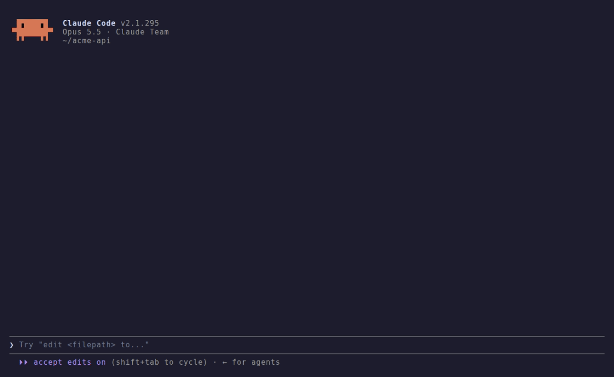
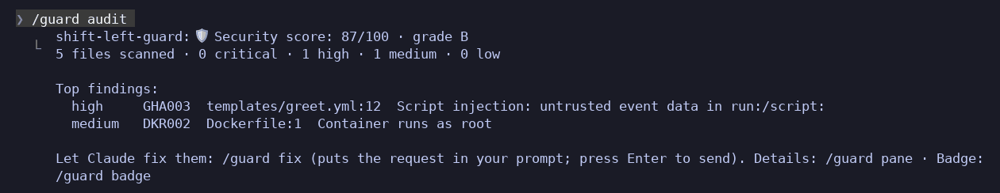
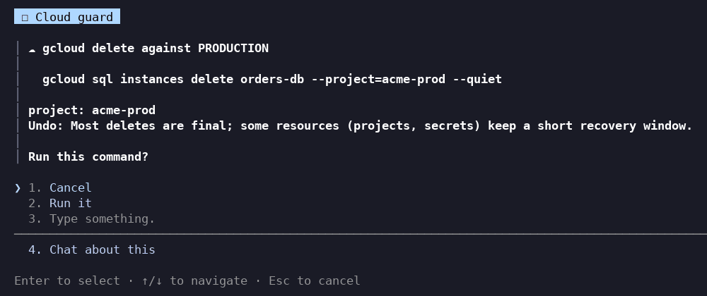

<h1 align="center">🛡 Shift-Left Guard</h1>

<p align="center">
  <a href="https://github.com/PascalNehlsen/shift-left-guard/actions/workflows/ci.yml"></a>
  <a href="https://github.com/PascalNehlsen/shift-left-guard/actions/workflows/zizmor.yml"></a>
  <a href="LICENSE"></a>
  <a href="https://github.com/PascalNehlsen/shift-left-guard"></a>
</p>

<p align="center"><b>Claude writes the code. Shift-Left Guard makes sure it is safe before it lands on your disk.</b></p>

<div align="center">



</div>

- **Insecure code never lands.** Workflows, Dockerfiles, Terraform, Kubernetes, Compose files and `package.json` are checked on every write. Claude gets the finding and fixes it itself.
- **Your agent's own config is guarded too.** Wildcard permissions in `.claude/settings.json`, unpinned MCP servers, tokens in `.mcp.json`, prompt injection hidden in `CLAUDE.md`.
- **Nothing deletes production by accident.** `terraform destroy`, `gcloud … delete` and their friends stop and show you what they would hit.

**Why, if Claude already writes secure code?** Risky code mostly comes from outside: templates, copy-paste, generators. We asked Claude to copy the platform team's workflow template three times without the guard. Every time it spotted the injection, and every time it left the vulnerable file on disk while asking whether to fix it. One "commit this" later, it ships. The guard turns "Claude noticed" into "the file is fixed", every time, for every model and teammate.

Runs locally inside Claude Code: no API keys, no network, nothing to configure.

## Install

You need Claude Code **2.1.287 or newer** (`claude --version`). In a Claude Code session:

```text
/plugin install shift-left-guard --marketplace PascalNehlsen/shift-left-guard
```

Answer `y` to add the marketplace, then pick **user scope** to guard every project.

## Your first 60 seconds

The guard is silent until it finds something. To see it work right away, open one of your repositories and run:

```text
/guard audit
```

You get a security score and grade for the repository, with its top findings:



Then `/guard fix` puts a fix request for all findings into your prompt: press Enter and Claude works through them, with the guard checking every fix. `/guard badge` gives you a README badge that follows your score.

## What you will see

**While Claude writes.** A risky write is stopped before it reaches the file. Claude reads what is wrong and how to fix it, and writes it again. The band above the prompt shows what was caught and, once fixed, the lines that changed. Every file Claude writes carries a `🛡 clean` or `🛡 fixed GHA003` mark in the transcript.

**When Claude runs shell commands.** Files written by `cp`, `sed -i`, heredocs or generators are checked right after the command, and Claude must fix them in the same step.

**Before destructive cloud commands.** You decide, with the blast radius in front of you. In production, **Cancel** is the default:



**When you are learning.** Turn on learning mode (`/config` → Shift-Left Guard → `explain`) and every finding explains why it is dangerous, with its CWE and a real incident. Claude explains it to you in its reply too.

**For your own commits and CI.** `/guard install-hook` runs the same rules on every `git commit` in the repository, and one Node script runs them in any pipeline, with SARIF for GitHub code scanning. See [CI](docs/ci.md).

## Commands

| Command | What it does |
| --- | --- |
| `/guard audit` | Score and grade the repository |
| `/guard fix` | Hand the audit's findings to Claude (fills your prompt; you press Enter) |
| `/guard badge` | Live README badge for your score |
| `/guard` | What the guard caught this session and all time |
| `/guard pane` | Every finding with its fix, in a side pane |
| `/guard rules` | All rules with their severity |
| `/guard install-hook` | Check your own commits in this repository too |
| `/guard pause` · `/guard resume` | Switch it off and on for this session |

## FAQ

<details>
<summary><b>Will it keep blocking me?</b></summary>

Only `high` and `critical` findings stop a write; lower ones are a note for Claude. Only what a change *introduces* counts, so old issues in existing files never block you. If the same findings come back after two tries, the write goes through with a warning, so a session never gets stuck. Change the threshold with `blockAt` ([Configuration](docs/configuration.md#settings)).
</details>

<details>
<summary><b>What about false positives?</b></summary>

The rules are tuned on real repositories (awesome-compose, n8n, mastodon, immich, the MCP servers and more). If one still fires wrongly, add `# guard:ignore <ID>` on the line (`<!-- guard:ignore <ID> -->` in Markdown), and please [report it](https://github.com/PascalNehlsen/shift-left-guard/issues/new/choose). Teams can add their own rules or switch rules off in [`.guard.json`](docs/configuration.md#team-rules-guardjson).
</details>

<details>
<summary><b>Does Claude see my secrets? Does anything leave my machine?</b></summary>

No. The guard checks with local rules, makes no model calls and no network requests, and stores only counters and rule IDs. When it reports a secret to Claude, the value is masked (`AKI****`). If Claude itself *wrote* the secret, Claude already knows it: the guard keeps it out of your files and your repository.
</details>

<details>
<summary><b>What does it run on my machine?</b></summary>

Everything it does goes through Claude Code's mod API and stays on your machine: it reads the file Claude is changing (and, for `/guard audit`, the files of the repository), runs `git` to find changed and ignored files, and keeps counters in the plugin's own store. It writes files only when you ask: `/guard install-hook` writes `.git/hooks/pre-commit` and a copy of the scanner into `.git/`, and `/guard badge` and `/guard audit` write `.github/shift-left-guard.json`. It installs no packages, makes no network requests and calls no model. `claude plugin validate .` lists every call it makes.
</details>

<details>
<summary><b>Does it slow Claude down?</b></summary>

No noticeable delay: a check is a few regular expressions over the one file being written.
</details>

<details>
<summary><b>Where does it work?</b></summary>

In the terminal and in the Claude Code desktop app. In the VS Code extension's chat panel, `claude -p` and the Agent SDK the checks run, but the band, marks and dialogs are not drawn.
</details>

<details>
<summary><b>Is this a replacement for my CI scanners or a sandbox?</b></summary>

No. A sandbox limits what Claude can *reach*; the guard limits what Claude *produces*. Keep `zizmor`, `hadolint`, `checkov` and `gitleaks` in CI: the guard is the fast first line, while the code is still being written.
</details>

## Learn more

- [Rules](docs/rules.md): all 42 rules, which files they apply to, and how to silence one
- [Configuration](docs/configuration.md): settings, team rules in `.guard.json`, pausing, updates
- [CI](docs/ci.md): pre-commit hook, pipeline, SARIF, score and live badge

> [!TIP]
> Community plugins do not update on their own. Turn on auto-update once: `/plugin` → **Marketplaces** → shift-left-guard → **Enable auto-update**.

## Contributing

New rules, fewer false positives and better fix texts are very welcome: see [CONTRIBUTING.md](CONTRIBUTING.md). To work on the guard, run `npm ci --prefix dev && npm --prefix dev test`, then `claude --plugin-dir .` (disable the installed copy first, or every finding shows twice). Security issues in the guard itself go through [SECURITY.md](SECURITY.md).

MIT, built by [Pascal Nehlsen](https://github.com/PascalNehlsen).
